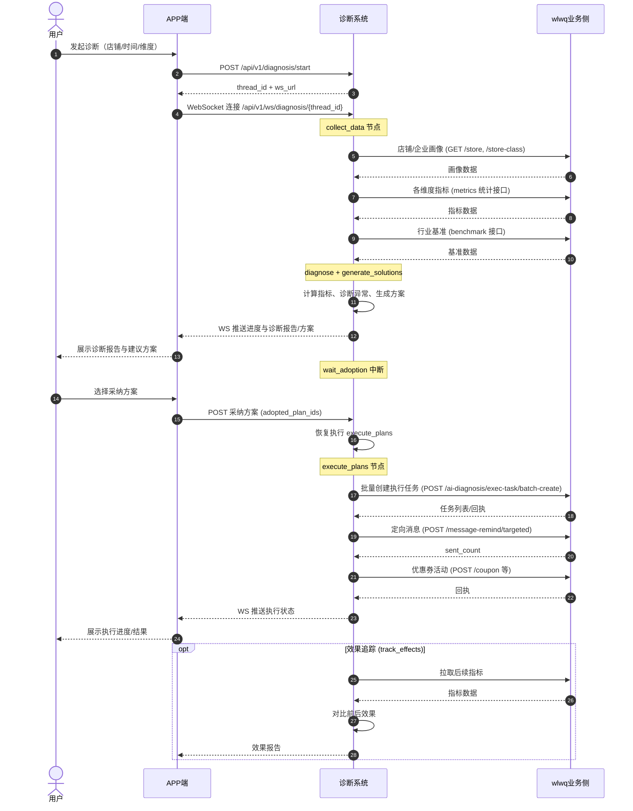

# 系统交互时序图（诊断流程）

```mermaid
sequenceDiagram
    autonumber
    actor 用户
    participant APP端
    participant 诊断系统
    participant wlwq业务侧

    用户->>APP端: 发起诊断（店铺/时间/维度）
    APP端->>诊断系统: POST /api/v1/diagnosis/start
    诊断系统-->>APP端: thread_id + ws_url
    APP端->>诊断系统: WebSocket 连接 /api/v1/ws/diagnosis/{thread_id}

    Note over 诊断系统: collect_data 节点
    诊断系统->>wlwq业务侧: 店铺/企业画像 (GET /store, /store-class)
    wlwq业务侧-->>诊断系统: 画像数据
    诊断系统->>wlwq业务侧: 各维度指标 (metrics 统计接口)
    wlwq业务侧-->>诊断系统: 指标数据
    诊断系统->>wlwq业务侧: 行业基准 (benchmark 接口)
    wlwq业务侧-->>诊断系统: 基准数据

    Note over 诊断系统: diagnose + generate_solutions
    诊断系统->>诊断系统: 计算指标、诊断异常、生成方案
    诊断系统-->>APP端: WS 推送进度与诊断报告/方案
    APP端-->>用户: 展示诊断报告与建议方案

    Note over 诊断系统: wait_adoption 中断
    用户->>APP端: 选择采纳方案
    APP端->>诊断系统: POST 采纳方案 (adopted_plan_ids)
    诊断系统->>诊断系统: 恢复执行 execute_plans

    Note over 诊断系统: execute_plans 节点
    诊断系统->>wlwq业务侧: 批量创建执行任务 (POST /ai-diagnosis/exec-task/batch-create)
    wlwq业务侧-->>诊断系统: 任务列表/回执
    诊断系统->>wlwq业务侧: 定向消息 (POST /message-remind/targeted)
    wlwq业务侧-->>诊断系统: sent_count
    诊断系统->>wlwq业务侧: 优惠券活动 (POST /coupon 等)
    wlwq业务侧-->>诊断系统: 回执

    诊断系统-->>APP端: WS 推送执行状态
    APP端-->>用户: 展示执行进度/结果

    opt 效果追踪 (track_effects)
        诊断系统->>wlwq业务侧: 拉取后续指标
        wlwq业务侧-->>诊断系统: 指标数据
        诊断系统->>诊断系统: 对比前后效果
        诊断系统-->>APP端: 效果报告
    end
```
