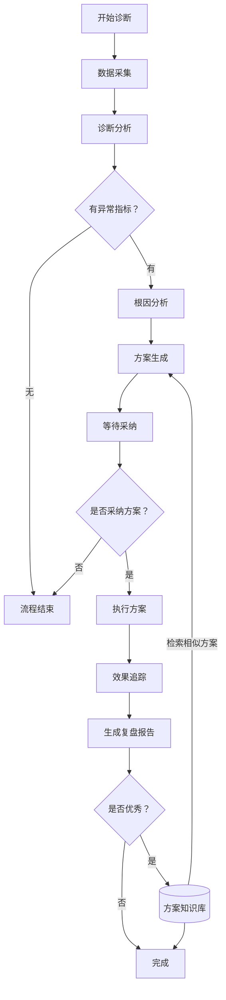

# 企业运营AI智能诊断系统技术文档

## 1. 产品介绍

面向电商行业提供企业级运营健康度分析服务。

### 核心能力

- **一键诊断**：CRM、营销、客户留存、运营效率 4 维度 20 项指标健康度评分
- **根因分析**：LLM 驱动的异常指标根因定位
- **方案生成**：AI 生成个性化优化方案，支持自动化营销动作
- **执行推送**：方案分解为任务推送至业务系统，支持人工审批
- **效果追踪**：执行前后指标对比，自动生成复盘报告

---

## 2. 指标维度

### 2.1 维度权重

| 维度代码 | 名称 | 权重 |
|----------|------|------|
| crm | CRM | 0.25 |
| marketing | 营销 | 0.30 |
| retention | 客户留存 | 0.30 |
| efficiency | 运营效率 | 0.15 |

### 2.2 CRM 维度指标

| 代码 | 名称 | 方向 | 单位 |
|------|------|------|------|
| lead_conversion_rate | 线索转化率 | h | % |
| response_time_avg | 平均响应时间 | l | 小时 |
| follow_up_count | 跟进次数 | h | 次 |

### 2.3 ⌈ 营销（marketing） ⌋ 维度指标

| 代码 | 名称 | 方向 | 单位 |
|------|------|------|------|
| coupon_redemption_rate | 优惠券核销率 | h | % |
| browse_to_order_rate | 浏览转化率 | h | % |
| order_conversion_rate | 订单转化率 | h | % |
| seckill_conversion_rate | 秒杀转化率 | h | % |

### 2.4 ⌈ 客户留存（retention） ⌋ 维度指标

| 代码 | 名称 | 方向 | 单位 |
|------|------|------|------|
| repurchase_rate | 复购率 | h | % |
| refund_rate | 退款率 | l | % |
| churn_rate | 流失率 | l | % |
| positive_review_rate | 好评率 | h | % |
| avg_customer_lifetime_value | 平均客户生命周期价值 | h | 元 |

### 2.5 ⌈ 运营效率（efficiency） ⌋ 维度指标

| 代码 | 名称 | 方向 | 单位 |
|------|------|------|------|
| service_completion_rate | 服务订单完成率 | h | % |
| avg_shipping_hours | 平均发货时效 | l | 小时 |

---

## 3. 相关计算

### 3.1 符号定义

| 符号 | 含义 |
|------|------|
| v | 企业该指标当前值 |
| μ | 行业基准均值 (avg_value) |
| e | 行业优秀值 (excellent_value) |
| n | 维度内参与打分的指标个数 |
| w_d | 维度 d 的权重 |

### 3.2 偏离度计算

**高于越好型指标**：

$$
\mathrm{deviation\_pct} = \frac{v - \mu}{\mu} \times 100
$$

**低于越好型指标**：

$$
\mathrm{deviation\_pct} = \frac{\mu - v}{\mu} \times 100
$$

### 3.3 单指标得分 (0-100)

$$
\mathrm{indicator\_score} = \mathrm{clip}(60 + 0.4 \times \mathrm{deviation\_pct},\, 0,\, 100)
$$

> 其中 $\mathrm{clip}(x,\,a,\,b)$ 将 $x$ 限制在闭区间 $[a,b]$ 内：$x<a$ 时取 $a$，$x>b$ 时取 $b$，否则取 $x$。
> 基准值为0时，该指标得分固定为60分。

### 3.4 维度得分

$$
\mathrm{dimension\_score} = \frac{1}{n} \sum \mathrm{indicator\_score}
$$

无可用指标时取60分。

### 3.5 综合健康度

$$
\mathrm{health\_score} = \sum_d w_d \cdot \mathrm{dimension\_score}_d
$$

### 3.6 异常判定

异常阈值 T = 15%

| 条件 | 严重度 |
|------|-------|
| deviation_pct < -30 | high |
| -30 ≤ deviation_pct < -20 | medium |
| -20 ≤ deviation_pct < -15 | low |

仅当 `deviation_pct < -15`（超过阈值 T）时记为异常；上表按负偏离幅度划分 **high / medium / low**，数值越负表示相对行业均值越差。`deviation_pct ≥ -15` 不进入异常列表。

### 3.7 效果变化率

$$
\mathrm{change\_pct} =
\begin{cases}
100 & v_b=0,\ v_a>0 \\
0 & v_b=0,\ v_a \le 0 \\
\frac{v_a - v_b}{|v_b|} \times 100 & \text{其余}
\end{cases}
$$

---

## 4. 诊断流程

### 流程阶段说明

| 阶段 | 说明 |
|------|------|
| 诊断 | 数据采集后进入诊断分析：指标与健康度、异常检测、报告；有异常时在同节点内做 LLM 根因（可关）
| 采纳 | 有异常：根因分析 → 知识库参考 → 方案生成 → 等待采纳 |
| 执行 | 方案推送到业务系统执行 |
| 追踪 | 效果对比与落库 → 生成复盘报告；达成率≥50% 时写入方案知识库
| 完成 | 全流程结束 |

---

## 5. 行业基准参考

系统内置电商行业基准数据，包含各指标的行业均值 (avg_value) 和优秀值 (excellent_value)。缺省时使用系统内置默认值。